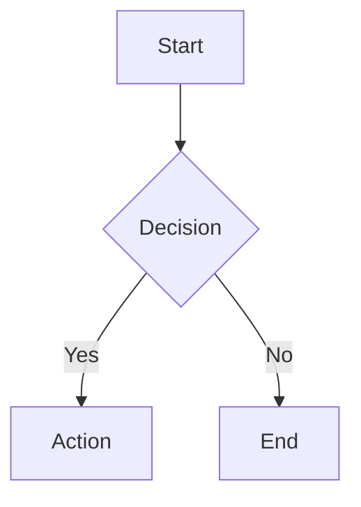

# Diagram Themes & Styling

Catryna uses a **Turbo Flow** inspired theme for all diagrams, providing consistent styling across React Flow and Mermaid charts.

## Color Palette

### Dark Mode
| Color | Hex | Usage |
|-------|-----|-------|
| Pink | `#e92a67` | Gradient start, accents |
| Purple | `#a853ba` | Primary borders, lines |
| Blue | `#2a8af6` | Gradient end, highlights |
| Dark BG | `#111111` | Background |
| Node BG | `#1a1a2e` | Node fill |

### Light Mode (Stripe-inspired)
| Color | Hex | Usage |
|-------|-----|-------|
| Accent | `#635BFF` | Borders, lines |
| Navy | `#0A2540` | Text |
| Surface | `#F6F9FC` | Node fill |
| White | `#FFFFFF` | Background |

## React Flow Diagrams

React Flow diagrams use custom components for the Turbo style:

### Node Types
- `default` - Standard nodes with gradient border glow
- `turbo` - Full Turbo style with animated gradient border (optional)

### Edge Types  
- `turbo` - Smoothstep routing with gradient stroke

### Key Styling Features
- **Glow effect**: Nodes have colored box shadows
- **Gradient edges**: Pink → Purple → Blue gradient on connection lines
- **Smoothstep routing**: Clean right-angle paths with `offset: 0` for tight connections
- **Handle positions**: Default to Top/Bottom for flexible layouts

```typescript
// Example node data structure
const nodes = [
  {
    id: '1',
    data: { label: 'My Node' },
    position: { x: 100, y: 100 },
    // Optional: override defaults
    sourcePosition: Position.Bottom,
    targetPosition: Position.Top,
  }
];
```

## Mermaid Diagrams

Mermaid charts automatically inherit the Turbo theme via CSS and theme variables.

### Supported Diagram Types
- Flowcharts
- Sequence diagrams
- State diagrams
- Entity relationship diagrams
- And more...

### Theme Features
- **Dark mode**: Purple borders with glow, gradient edges
- **Light mode**: Stripe purple borders with subtle drop shadows
- **Monospace font**: JetBrains Mono for technical feel
- **Edge labels**: Subtle drop shadows for contrast

### Example Mermaid


## CSS Files

### `frontend/index.css`
Contains all Turbo Flow styling:
- React Flow node/edge styles
- Mermaid theme overrides
- Dark/light mode variants
- Glow and shadow effects

### Key CSS Classes
```css
/* React Flow */
.react-flow__node-default { /* Node styling */ }
.react-flow__edge-path { /* Edge gradient */ }
.react-flow__handle { /* Connection points */ }

/* Mermaid */
.mermaid-container .node rect { /* Node boxes */ }
.mermaid-container .edgePath .path { /* Lines */ }
.mermaid-container .edgeLabel { /* Labels */ }
```

## Creating Diagrams

When creating new documentation with diagrams:

1. **React Flow**: Use the `create_diagram` MCP tool - styling is automatic
2. **Mermaid**: Use the `create_mermaid_diagram` tool or embed in markdown blocks
3. **Colors will match** the current theme (dark/light mode)
4. **No extra config needed** - themes are applied via CSS