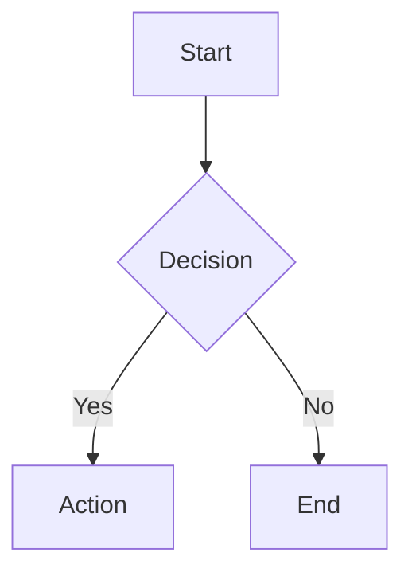

# Diagram Themes & Styling

Catryna uses a **Turbo Flow** inspired theme for all diagrams, providing consistent styling across React Flow and Mermaid charts.

## Color Palette

### Dark Mode
| Color | Hex | Usage |
|-------|-----|-------|
| Pink | `#e92a67` | Gradient start, accents |
| Purple | `#a853ba` | Primary borders, lines |
| Blue | `#2a8af6` | Gradient end, highlights |
| Dark BG | `#111111` | Background |
| Node BG | `#1a1a2e` | Node fill |

### Light Mode (Stripe-inspired)
| Color | Hex | Usage |
|-------|-----|-------|
| Accent | `#635BFF` | Borders, gradient start |
| Purple | `#a853ba` | Gradient midpoint |
| Cyan | `#00D4FF` | Gradient end |
| Navy | `#0A2540` | Text |
| Surface | `#F6F9FC` | Node fill |
| White | `#FFFFFF` | Background |

Light mode is selected by the absence of the `dark` class on `<html>`: every override is written as `:root:not(.dark) …`.

## Where the theming code lives

Both halves moved out of `App.tsx` when the viewer's bundle was code-split, and
they are now the *only* modules that import their library:

| File | Owns |
|---|---|
| `components/MermaidDiagram.tsx` | `initMermaid()`, the `themeVariables` maps, and the SVG post-processing |
| `components/FlowDiagram.tsx` | `nodeTypes` / `edgeTypes`, node & edge normalization, both canvases |
| `components/TurboEdgeGradient.tsx` | the gradient `<defs>` |
| `index.css` | everything CSS-side (see below) |

Keep it that way: both are lazy boundaries, and a static import of `mermaid` or
`reactflow` from `App.tsx` puts the whole library back in the entry chunk. See
the `frontend/overview` doc.

## React Flow Diagrams

React Flow diagrams use custom components for the Turbo style:

### Node Types
- `default` - React Flow's built-in node, restyled by `.react-flow__node-default`: a `#1a1a2e → #16213e` gradient fill with a `#2a8af6` border and blue glow. Nodes with no `type` land here.
- `turbo` - The only custom type registered (`nodeTypes = { turbo: TurboNode }`). Conic-gradient border ring, `JetBrains Mono`, cloud badge. The ring only *animates* while the node is `.selected`.

### Edge Types  
- `turbo` - Smoothstep routing with gradient stroke. Applied automatically: every edge is mapped to `type: edge.type || 'turbo'`, and `defaultEdgeOptions={{ type: 'turbo' }}` covers the rest. Arrow markers are deliberately omitted.

### Key Styling Features
- **Glow effect**: Nodes have colored box shadows
- **Gradient edges**: Pink → Purple → Blue gradient on connection lines
- **Smoothstep routing**: Clean right-angle paths with `borderRadius: 8` and `offset: 0` for tight connections
- **Handle positions**: `normalizeNodes()` in `components/FlowDiagram.tsx` defaults every node to `sourcePosition: Bottom` / `targetPosition: Top`. This only affects `default` nodes — `TurboNode` hardcodes its handles to Left (target) / Right (source), so those props are ignored for `turbo` nodes.

<Callout type="warning">
Edge colour does **not** currently follow the theme. `.react-flow__edge .react-flow__edge-path` always strokes `url(#turbo-edge-gradient)`, the dark pink→purple→blue gradient, and out-specifies the `:root:not(.dark)` `#635BFF` fallback. `TurboEdgeGradient` also defines `#turbo-edge-gradient-light`, but nothing references it — so light-mode diagrams draw dark-mode edges.
</Callout>

```typescript
// Example node data structure
const nodes = [
  {
    id: '1',
    data: { label: 'My Node' },
    position: { x: 100, y: 100 },
    // Optional: override defaults
    sourcePosition: Position.Bottom,
    targetPosition: Position.Top,
  }
];
```

## Mermaid Diagrams

Mermaid charts automatically inherit the Turbo theme via CSS and theme variables. The variables come from `initMermaid(isDark)` in `components/MermaidDiagram.tsx` (`theme: 'base'` plus a full dark/light `themeVariables` map); it runs from an effect keyed on `isDark`, immediately before each render, so a theme switch re-themes and re-renders every diagram on screen. The same component then post-processes the SVG — injecting the `#mermaid-gradient` def and rewriting edge-label backgrounds, which inline Mermaid styles would otherwise get wrong.

`isDark` is **resolved by `App.tsx` and passed down**, not derived from the mode
preference inside the renderer. That distinction is the whole point: Atelier
pins dark regardless of the stored `light`/`dark`/`system` mode, so a renderer
that only read `prefs.theme` would theme diagrams against the wrong canvas.

<Callout type="warning">
It did exactly that. With Atelier selected and a stored mode of `light`, mermaid
was initialized light and the post-processor wrote `background:#ffffff;
color:#0A2540` into the edge labels — light chips on the `#0d0d16` canvas. The
node fills *looked* right only because the `.dark` CSS overrides in `index.css`
repainted them, which is also why the bug survived: CSS masked the half of the
theming it happens to cover, and the inline half stayed wrong.
</Callout>

### Supported Diagram Types
- Flowcharts
- Sequence diagrams
- State diagrams
- Entity relationship diagrams
- And more...

### Theme Features
- **Dark mode**: Purple borders with glow, gradient edges
- **Light mode**: Stripe purple borders with subtle drop shadows
- **Monospace font**: JetBrains Mono for technical feel
- **Edge labels**: Subtle drop shadows for contrast

### Example Mermaid

```mermaid
flowchart TD
    A[Start] --> B{Decision}
    B -->|Yes| C[Action]
    B -->|No| D[End]
```

## CSS Files

### `frontend/index.css`
Contains the CSS half of the Turbo Flow styling:
- React Flow node/edge/controls/minimap styles
- Mermaid theme overrides (`.mermaid-container …`)
- Dark/light mode variants, via `.dark` and `:root:not(.dark)`
- Glow and shadow effects

It also carries the app-wide **theme system** (the palette variable sets for
`classic` / `atelier`, the reading, trust and search polish). Those are separate
concerns that share a file: the diagram styling above keys off the `.dark`
class, while the named themes key off `[data-theme]`, so the two do not
interact. See the `frontend/overview` doc.

The rest lives in TSX: Mermaid's `themeVariables` and the SVG post-processing in `components/MermaidDiagram.tsx`, and the gradient `<defs>` in `components/TurboEdgeGradient.tsx`.

### Key CSS Classes
```css
/* React Flow */
.react-flow__node-default { /* Node styling */ }
.react-flow__edge-path { /* Edge gradient */ }
.react-flow__handle { /* Connection points */ }

/* Mermaid */
.mermaid-container .node rect { /* Node boxes */ }
.mermaid-container .edgePath .path { /* Lines */ }
.mermaid-container .edgeLabel { /* Labels */ }
```

## Creating Diagrams

When creating new documentation with diagrams:

1. **React Flow**: Use the `create_diagram` MCP tool - styling is automatic
2. **Mermaid**: Use the `create_mermaid_diagram` tool or embed in markdown blocks
3. **Colors will match** the current theme (dark/light mode) — except React Flow edge strokes, see the warning above
4. **No extra config needed** - themes are applied via CSS and `initMermaid()`

## TurboNode typing

`TurboNode` takes `NodeProps<TurboNodeData>` — in reactflow 11 `NodeProps<T>` is parameterized by the **data** type, not by `Node<T>`. It previously declared `NodeProps<Node<TurboNodeData>>`, which typed `data` as a node object and made every field access (`data.icon`, `data.title`, `data.subtitle`) a type error. Runtime was always correct; only the type was wrong, and it went unnoticed because the project had no React types at all.
