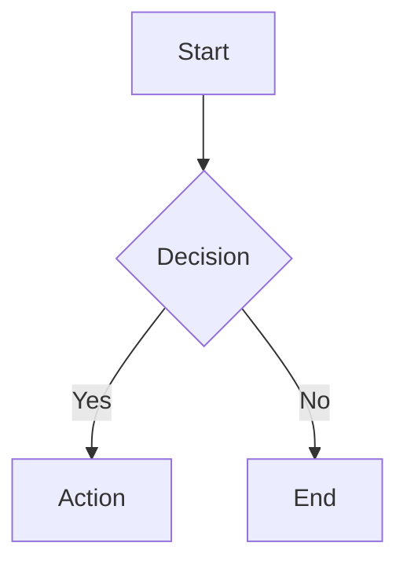

# Diagram Themes & Styling

Catryna uses a **Turbo Flow** inspired theme for all diagrams, providing consistent styling across React Flow and Mermaid charts.

## Color Palette

### Dark Mode
| Color | Hex | Usage |
|-------|-----|-------|
| Pink | `#e92a67` | Gradient start, accents |
| Purple | `#a853ba` | Primary borders, lines |
| Blue | `#2a8af6` | Gradient end, highlights |
| Dark BG | `#111111` | Background |
| Node BG | `#1a1a2e` | Node fill |

### Light Mode (Stripe-inspired)
| Color | Hex | Usage |
|-------|-----|-------|
| Accent | `#635BFF` | Borders, gradient start |
| Purple | `#a853ba` | Gradient midpoint |
| Cyan | `#00D4FF` | Gradient end |
| Navy | `#0A2540` | Text |
| Surface | `#F6F9FC` | Node fill |
| White | `#FFFFFF` | Background |

Light mode is selected by the absence of the `dark` class on `<html>`: every override is written as `:root:not(.dark) …`.

## Where the theming code lives

Both halves moved out of `App.tsx` when the viewer's bundle was code-split.
Each is the only **eagerly reachable** module that imports its library — the
Turbo components import `reactflow` too, but nothing reaches them except through
`FlowDiagram`, so they ride in its lazy chunk:

| File | Owns |
|---|---|
| `components/MermaidDiagram.tsx` | `initMermaid()`, the `themeVariables` maps, and the SVG post-processing |
| `components/FlowDiagram.tsx` | `nodeTypes` / `edgeTypes`, node & edge normalization, both canvases |
| `components/TurboEdge.tsx` | the per-edge `<linearGradient>` and the smoothstep path |
| `index.css` | everything CSS-side (see below) |
| `styles/vendor-reactflow.css` | reactflow's own sheet, wrapped in `layer(vendor)` |

Keep it that way: both are lazy boundaries, and a static import of `mermaid` or
`reactflow` from `App.tsx` puts the whole library back in the entry chunk. See
the `frontend/overview` doc.

## React Flow Diagrams

React Flow diagrams use custom components for the Turbo style:

### Node Types
- `default` - React Flow's built-in node, restyled by `.react-flow__node-default`: a `#1a1a2e → #16213e` gradient fill with a `#2a8af6` border and blue glow. Nodes with no `type` land here.
- `turbo` - The only custom type registered (`nodeTypes = { turbo: TurboNode }`). Conic-gradient border ring, `JetBrains Mono`, cloud badge. The ring only *animates* while the node is `.selected`.

<Callout type="warning">
**A custom node type must forward `isConnectable` to its `Handle`s.** reactflow
resolves the canvas-level `nodesConnectable` and hands the result to each node as
a prop — `Handle` never reads it from the store, and its own default is `true`.
`TurboNode` destructured only `data`, so on a canvas with connections switched
off its handles stayed live (crosshair cursor, `pointer-events: all`,
click-connect latching) while the connection line was suppressed, since *that*
does read the store. The built-in types forward it, which is why the gap only
shows on `turbo` nodes.
</Callout>

### Edge Types  
- `turbo` - Smoothstep routing with gradient stroke. Applied automatically: every edge is mapped to `type: edge.type || 'turbo'`, and `defaultEdgeOptions={{ type: 'turbo' }}` covers the rest. Arrow markers are deliberately omitted.

### Key Styling Features
- **Glow effect**: Nodes have colored box shadows
- **Gradient edges**: Pink → Purple → Blue gradient on connection lines
- **Smoothstep routing**: Clean right-angle paths with `borderRadius: 8` and `offset: 0` for tight connections
- **Handle positions**: `normalizeNodes()` in `components/FlowDiagram.tsx` defaults every node to `sourcePosition: Bottom` / `targetPosition: Top`. This only affects `default` nodes — `TurboNode` hardcodes its handles to Left (target) / Right (source), so those props are ignored for `turbo` nodes.

<Callout type="info">
**Edge colour follows the theme now, and the way it does changed.** Each edge
emits its OWN `<linearGradient>` from `components/TurboEdge.tsx`, applied as an
inline `stroke`; the stops read `--turbo-edge-0/1/2`, which `index.css` defines
per theme. There is no shared `<defs>` any more — `TurboEdgeGradient.tsx` is
deleted.

Three things drove that, and the first is the one worth remembering:

- **A perfectly vertical or horizontal edge used to render as nothing at all.**
  The shared gradients used the default `gradientUnits="objectBoundingBox"`,
  which is measured against the path's bounding box — and such an edge has a box
  with zero width or height, so SVG ignores the paint server entirely. Reachable
  with ordinary `default` nodes: `normalizeNodes` gives them Bottom → Top
  handles, so stacking two at the same x produces exactly that path. Measured
  in-app: `bbox: [0, 174]`, invisible before, drawn now. `userSpaceOnUse`
  anchored to the edge's own endpoints has no bounding box to degenerate.
- **Light mode never got a gradient.** `#turbo-edge-gradient-light` was defined
  and referenced nowhere.
- **Duplicate IDs were reachable.** `FlowDiagram` and `FlowEditorCanvas` each
  rendered the shared `<defs>`, so opening the editor over a doc that already
  showed a diagram put two `id="turbo-edge-gradient"` in one document. Harmless
  while identical, silently wrong the moment they were not — `url(#id)` takes
  the first in document order. Per-edge IDs remove the class of bug.
</Callout>

<Callout type="warning">
**An earlier version of this callout described the bug incorrectly**, and the
correction is instructive. It claimed the dark gradient "out-specifies the
`:root:not(.dark)` `#635BFF` fallback — so light-mode diagrams draw dark-mode
edges." Backwards: `:root:not(.dark) .react-flow__edge-path` is (0,3,0) and
already beat `.react-flow__edge .react-flow__edge-path` at (0,2,0). Light mode
was never drawing dark edges; it was drawing a theme-correct but **flat**
`#635BFF` and losing the gradient. Measured at the time on
`diagrams/system-architecture`: dark `url("#turbo-edge-gradient")`, light
`rgb(99, 91, 255)`.
</Callout>

```typescript
// Example node data structure
const nodes = [
  {
    id: '1',
    data: { label: 'My Node' },
    position: { x: 100, y: 100 },
    // Optional: override defaults
    sourcePosition: Position.Bottom,
    targetPosition: Position.Top,
  }
];
```

## Mermaid Diagrams

Mermaid charts automatically inherit the Turbo theme via CSS and theme variables. The variables come from `initMermaid(isDark)` in `components/MermaidDiagram.tsx` (`theme: 'base'` plus a full dark/light `themeVariables` map); it runs from an effect keyed on `isDark`, immediately before each render, so a theme switch re-themes and re-renders every diagram on screen. The same component then post-processes the SVG — injecting the `#mermaid-gradient` def and rewriting edge-label backgrounds, which inline Mermaid styles would otherwise get wrong.

`mermaid.initialize()` is **global singleton state**, so that effect is
cancellable: a fast theme toggle can leave an earlier `mermaid.render` in flight
that resolves after the newer one, and without a guard the stale SVG — carrying
the previous theme's post-processing — would win the `setSvg` race. Superseded
results are discarded instead. (A twelve-flip burst converges correctly with and
without the guard; the ordering is not something to rely on.)

`isDark` is **resolved by `App.tsx` and passed down**, not derived from the mode
preference inside the renderer. That distinction is the whole point: Atelier
pins dark regardless of the stored `light`/`dark`/`system` mode, so a renderer
that only read `prefs.theme` would theme diagrams against the wrong canvas.

<Callout type="warning">
It did exactly that. Atelier disables the mode buttons but never resets the
stored value, so `{themeStyle:'atelier', theme:'light'}` is an ordinary state to
be in — and mermaid was then initialized with the **light** `themeVariables` on
the `#0d0d16` canvas.

What made it survive so long is *which* half of the damage CSS covered. The
`.dark .mermaid-container …` rules in `index.css` are `!important`, so they
outrank even inline `style` attributes — flowchart node fills, edge strokes and
edge labels were all repainted correctly no matter what mermaid was initialized
with. The rules are written for flowchart-shaped selectors (`.node`,
`.edgeLabel`, `.edgePath`), so anything they do not name kept the light values.

The clearest survivor is a **sequence diagram**: its actor labels are `<tspan>`
elements carrying mermaid's `actorTextColor`, and no `.dark` rule targets them.
In Atelier they rendered `#0A2540` on the `#1a1a2e` actor box — dark-on-dark,
effectively invisible. Verified before and after the fix on the same diagram:
`rgb(10,37,64)` → `rgb(243,244,246)`.
</Callout>

### Supported Diagram Types
- Flowcharts
- Sequence diagrams
- State diagrams
- Entity relationship diagrams
- And more...

### Theme Features
- **Dark mode**: Purple borders with glow, gradient edges
- **Light mode**: Stripe purple borders with subtle drop shadows
- **Monospace font**: JetBrains Mono for technical feel
- **Edge labels**: Subtle drop shadows for contrast

### Example Mermaid

```mermaid
flowchart TD
    A[Start] --> B{Decision}
    B -->|Yes| C[Action]
    B -->|No| D[End]
```

## CSS Files

### `frontend/index.css`
Contains the CSS half of the Turbo Flow styling:
- React Flow node/edge/controls/minimap styles
- Mermaid theme overrides (`.mermaid-container …`)
- Dark/light mode variants, via `.dark` and `:root:not(.dark)`
- Glow and shadow effects
- `.react-flow__handle:not(.connectable) { opacity: 0 }` — both canvases run
  with `nodesConnectable={false}`, and reactflow only makes such a handle
  *inert*, not invisible. An 8px dot that reads as "drag from here" and cannot
  do anything is the affordance the flag was meant to remove, so it is hidden.
  Genuinely connectable handles keep the dot.

reactflow's own stylesheet is imported by `FlowDiagram` through
`styles/vendor-reactflow.css`, which wraps it in `@layer vendor`. That is not
cosmetic: chunk CSS loads *after* `index.css`, and unlayered rules of equal
specificity are decided by order, so importing it directly let reactflow's
`.react-flow__node-default { color: #222 }` beat the themed light text — three
nodes rendered as empty dark rectangles.

Unlayered rules — which is everything hand-written below — beat any layer. But
the layer's *position* still matters for the Tailwind-generated half of the same
file, so `index.css` declares the order explicitly on line 1
(`@layer properties, theme, base, vendor, components, utilities`). Without it,
`vendor` is first declared in the lazily-injected chunk and sorts above
`utilities`. See the `frontend/overview` doc.

Note the cost of layering: unlayered app CSS now outranks the vendor sheets
whatever the specificity, so global selectors in `index.css` can reach into the
canvases. **Five already did**, and only two were caught the first time —
`* { -webkit-tap-highlight-color }` and the mobile 44px touch-target floor.
Review found three more, all Atelier-scoped: `:focus-visible` overriding the
whiteboard's focus ring on every control, the `h1/h2/h3` display rule putting
Fraunces on its dialog headings, and `::selection` recolouring its text editor.
Each now carries `:not(.excalidraw *)` or an `.excalidraw` reset.

The lesson worth keeping: after layering a vendor sheet, audit **every**
unlayered global in `index.css` against the vendor's DOM, not just the ones that
happen to look risky.

It also carries the app-wide **theme system** (the palette variable sets for
`classic` / `atelier`, the reading, trust and search polish). Those are separate
concerns that share a file: the diagram styling above keys off the `.dark`
class, while the named themes key off `[data-theme]`, so the two do not
interact. See the `frontend/overview` doc.

The rest lives in TSX: Mermaid's `themeVariables` and the SVG post-processing in `components/MermaidDiagram.tsx`, and the per-edge gradient `<defs>` emitted by `components/TurboEdge.tsx` (one `<linearGradient>` per edge, `gradientUnits="userSpaceOnUse"`, stops reading `--turbo-edge-0/1/2`).

### Key CSS Classes
```css
/* React Flow */
.react-flow__node-default { /* Node styling */ }
.react-flow__edge-path { /* Edge gradient */ }
.react-flow__handle { /* Connection points */ }
.react-flow__handle:not(.connectable) { /* hidden — see below */ }

/* Mermaid */
.mermaid-container .node rect { /* Node boxes */ }
.mermaid-container .edgePath .path { /* Lines */ }
.mermaid-container .edgeLabel { /* Labels */ }
```

## Creating Diagrams

When creating new documentation with diagrams:

1. **React Flow**: Use the `create_diagram` MCP tool - styling is automatic
2. **Mermaid**: Use the `create_mermaid_diagram` tool or embed in markdown blocks
3. **Colors will match** the current theme (dark/light mode) — except React Flow edge strokes, see the warning above
4. **No extra config needed** - themes are applied via CSS and `initMermaid()`

## TurboNode typing

`TurboNode` takes `NodeProps<TurboNodeData>` — in reactflow 11 `NodeProps<T>` is parameterized by the **data** type, not by `Node<T>`. It previously declared `NodeProps<Node<TurboNodeData>>`, which typed `data` as a node object and made every field access (`data.icon`, `data.title`, `data.subtitle`) a type error. Runtime was always correct; only the type was wrong, and it went unnoticed because the project had no React types at all.
